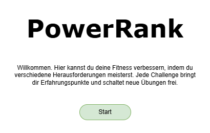
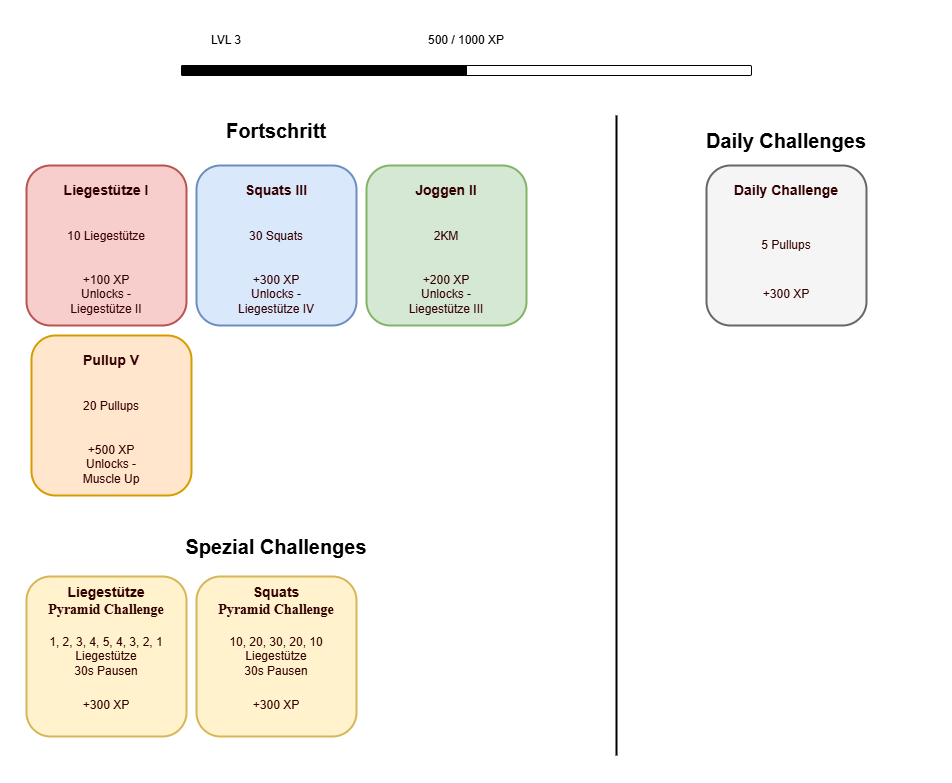

## Wireframes

Start-Page

Challenge-Page

## Styleguide

### Farben

| Farbname            | Farbwert (Hex) | Dunklere Variante       |
|---------------------|----------------|--------------------------|
| Hintergrund         | `#121212`      | –                        |
| Text                | `#f0f0f0`      | –                        |
| Karten-Hintergrund  | `#1e1e1e`      | –                        |
| Rot                 | `#d66`         | `#5e2626`                |
| Orange              | `#e99b42`      | `#55390f`                |
| Gelb                | `#e6d66c`      | `#4b4a2b`                |
| Grün (Hauptfarbe)   | `#4c4`         | `#1b541b`                |
| Cyan                | `#52b0ba`      | `#1f3e42`                |
| Blau                | `#66c`         | `#2a2b53`                |
| Grau                | `#999`         | `#444444`                |
| Differenzfarben     | `#f00`         | `#880000` / `#440000`    |

### Typografie

| Element             | Wert                    |
|---------------------|-------------------------|
| Schriftart          | `Open Sans`, sans-serif |
| Titel               | `1.5rem`                |
| Kartentitel         | `1.1rem`                |
| Kartentext          | `0.95rem`              |

Logo

Favicon
